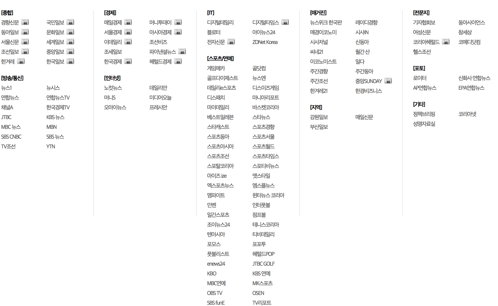

# Personal Project   
------------------------------------------------------------------------------------------------------------  
# Description  
## Object
> 뉴스의 본문의 키워드를 추출하여 본문이 해당 키워드에 대하여 긍정적으로 서술하는지 부정적으로 서술하는지를 분석할 수 있다. 
> 뉴스의 댓글을 분석하여 뉴스에 댄 긍정 부정 분석을 할 수 있다. 
## 0. 데이터 수집. 
> * package : selenium, requests, BeautifulSoup, etc.
> 
> ### 1. 포털(네이버, 다음)에서 일별로 카테고리 분류에 따라 랭킹뉴스를 수집    
>> * 네이버
>>  네이버뉴스 > 랭킹뉴스 > 많이 본 뉴스
>> * 다음 
>>  
>> * 뉴스는 본문,  신문사, 랭킹순위, 카테고리, 날짜, 사이트, 댓글수, 크롤링한 댓글수  
>>
>> #### 다음.  
>> DAUM 뉴스에 등록된 언론사 목록  
>>   
>> * 키워드를 제공해주는 경우가 많아 키워드도 같이 크롤링하고 없는 경우에는 NaN으로 처리함.
>> * keyword를 추출하는 알고리즘을 이용하여 추가로 키워드를 추출.  
>>  
>> | category | date | link | press | rank | title | mainText | keywords | number of comments |  real comment | site |  
>> |:------------|:------:|:-----:|:-------:|:------:|:----:|:-------------:|:-----------:|:-----------------------:|:---------------:|------:|
>> | category | date|link | press | rank | title | mainText | keyword | number of comments |  real comment | site |  
>> 
>> #### 네이버.  
>> NAVER 뉴스에 등록된 언론사 목록  
>>   
>> * 키워드를 제공해주지 않아 다음에서 동일한 기사를 찾아 키워드를 찾아서 크롤링함. 없는 경우에는 NaN으로 처리함.  
>> * keyword를 추출하는 알고리즘을 이용하여 추가로 키워드를 추출. 
>> 
>> | category | date | link | press | rank | title | mainText | number of comments |  real comment | site | keywords |  
>> |:------------|:------:|:-----:|:-------:|:------:|:----:|:-------------:|:----------------------------:|:--------------------:|:----:|--------------:|
>> | category | date | link | press | rank | title | mainText | number of comments |  real comment | site | keywords |  
>
> ### 2. 해당 뉴스에 대한 전체 댓글 내용과 각 댓글의 공감/비공감 수.  
>>   
>> #### 댓글.  
>> 
>> | category | date | link | comment | 공감 | 비공감 | site |  
>> |:------------|:------:|:-----:|:------------:|:-----:|:---------:|-----:|  
>> | category | date | link | comment | 공감 | 비공감 | site |  
>>  
> ### 3. 감정분석을 위한 데이터 수집
>> * naver movie sentiment, 공공 데이터포털의 뉴스빅데이터 분석 정보 파일([빅카인즈](https://www.kinds.or.kr/) )중 주제에 따라 감정분석과, 긍정문장, 부정문장을 가지고 있는 문서가 존재하여 이를 이용하고자 함. 
>> * 공공 데이터포털의 뉴스빅데이터 분석 정보 파일.  
>>>  긍정 문장 : 156291.   
>>>  긍정 단어 : 632330.   
>>>  부정 문장 : 161297.   
>>>  부정 단어 :  1617233.   
>>  * naver movie sentiment analysis.   
>>>  20만건.  

## 2. 데이터베이스 구축
> 크롤링을 통해 수집 뉴스 및 댓글 데이터를 저장할 데이터 베이스를 구축.  
> mongoDB.  
> * 1차 데이터 수집
>> 2017.12.01 ~ 2018.02.01. (63일) 
> * DB 구축.  
>> * news - Daum : 9372.  
>> * news - Naver : 15120.  
>> * comments : 16813332.  
> 
> * 2차 데이터 수집 (진행)
>> 2018.02.02 ~  

## 3. 키워드 추출
> * 한글 자연어 처리를 위하여 [konlpy](konlpy.org)와 konlpy를 customization한 [customized-konlpy](https://github.com/lovit/customized_konlpy) 패키지를 사용하여 품사를 태깅함.  
> * 뉴스의 핵심 키워드(keyword)를 찾기 위하여 구글의 pagerank를 응용한 코드를 이용  [참고](http://excelsior-cjh.tistory.com/entry/TextRank%EB%A5%BC-%EC%9D%B4%EC%9A%A9%ED%95%9C-%EB%AC%B8%EC%84%9C%EC%9A%94%EC%95%BD).  
> * konlpy의 Twitter와 mecab를 이용하여 품사를 태깅 후 키워드를 추출해본 결과, 뉴스를 읽어본 후 생각한 키워드 그리고 다음(Daum)에서 제공하는 키워드와 일치하지 않는 경우가 다수 발견됨을 확인하고 이를 해결하기 위한 방안을 모색함.  
> 
>> * konlpy의 Twitter와 mecab에 등록되지 않은 단어일 경우, 정확하게 품사를 태깅하지 못한다는 사실을 확인함. 
>> * konlpy에서 사용하는 품사 태깅 패키지인 Kkma, Twitter, komoran, Hannanum 등은 2017년 12월을 기준으로 최신화되어 있지 않다는 사실과 함께 저작권 등의 문제로 품사 태깅에 사용하는 raw data를 제공하지 않음.  
>> * konlpy의 mecab은 사용자 사전을 추가할 수 있으며 또한, konlpy의 Twitter에 사용자 사전을 추가할 수 있는 customized-konlpy라는 파이썬 패키지가 있음을 확인하고 이 두 개를 이용하여 사용자 사전을 최신화한 후 이용하기로 결정함.  
>> * 사용자 사전을 추가한 후, 품사를 태깅한 결과, 100% 일치하지는 않았지만, 조금더 나은 결과가 나옴을 확인하고 이후 과정을 진행함.  
>> 
> ### * 사전작업 - 사용자사전 추가  
> #### 1. 한글 자연어 처리를 위하여 customized-Konlpy와 mecab에 사용자 사전을 추가. 
> #### 2. 나무위키(namuwiki)와 위키피디아(wikipedia)의 title을 가지고 와서 전처리 작업을 거친후 명사만을 추가함. 
> #### 3. 공공 데이터포털의 뉴스빅데이터 분석 정보 파일([빅카인즈](https://www.kinds.or.kr/) )을 이용하여 명사 그리고 키워드를 추출하고 이후 전처리 작업을 통해 명사만을 추가함.  
> #### 4. NIA 빅데이터 센터에서 2017년 2월에 제공한 한글형태소 사전을 cKonlpy와 mecab에 추가함.  
> 
>> * 국립국어원 우리말샘 사전과 및 SNS 분석기업 인사이터에서 자체 보유한 사전을 기반으로 최신 단어로 구성된 형태소 사전(NIADic) 제작(총 93만 단어)함.    
>> * 국립국어원 ‘우리말샘’ : 기존 ‘표준국어대사전’에 수록된 50만 단어와 신어·생활어 7만5000단어, 지역어 9만단어, 전문용어 35만단어를 더해 모두 100만여 단어로 구성.  
>> * 인사이터 자체사전 : 브랜드, 유명인, 장소, 신조어 등의 명사 위주로 모두 50만여 단어로 구성.  
>>  
> ### * 키워드 추출. 
> * TextRank algorithm을 이용하여 키워드를 추출
>> * 규칙
>>  * Mecab과 ckonlpy를 형태소 분석기를 사용하여 각각의 뉴스에 대하여 10개씩의 키워드를 추출. 
>> * Mecab과 ckonlpy 두 형태소 분석기의 명사추출과 형태소추출을 같이 이용하여서도 각각의 뉴스에 대하여 10개씩의 키워드를 추출. 
>> * TextRank를 이용하여 형태소 분석을 진행할때, 명사추출과 형태소추출을 같이 이용하여 n-gram을 (1-5)까지 허용함.  
>> * 나온 결과에 대하여 사후처리를 함. 
>> * 2개의 형태소 분석기를 사용하여 나온 10개의 키워드에 대하여 2개에서 모두 나온 키워드는 우선으로 사용하는 것을 원칙으로 함.  
>> * 각각의 결과 중에서 단어가 조금씩 다른 키워드에 대하여 90%이상 매치되는 키워드를 추출함.  

## 4. 통계 분석
> * 네이버 뉴스의 언론사에 따른 분석
> * 다음 뉴스의 언론사에 따른 분석
  
## 5. 키워드 분석 (진행중)
> * 뉴스 본문에서 추출한 키워드에 대하여 일별 키워드 빈도를 분석하여 워드클라우드를 그릴수 있다. 
> * 일별 랭킹뉴스에서 키워드의 빈도를 추출하여 일별 키워드를 파악할 수 있다. 
> * 동일한 키워드에 대하여 여러 신문사의 긍부정 분석을 파악하여 논조를 파악할 수 있다. 
> * 동일한 키워드를 가진 뉴스에 대하여 댓글의 성향이 얼마나 다른지에 대하여 분석을 해보고자 함. 
> * 신문사, 키워드 등의 정보를 이용하여 분류
> * 신문사, 키워드 등의 정보를 이용하여 클러스터링
> * 시각화 작업
> * 키워드 사이의 연관성

## 6. 댓글 분석 (진행중)
> * 감정분석을 실시.   
>> * package : gensim, sklearn, etc.
>> * Doc2Vec.  
>> * Work2Vec.  
>> * FastText.   

## 7. 웹 구축. 
> Flask를 이용하여 Amazone Web Service(AWS)에 웹 구축 (예정). 
   
------------------------------------------------------------------------------------------------------------        
## 참고
* [konlpy](konlpy.org)
* [customized konlpy](https://github.com/lovit/customized_konlpy)
* [datascienceschool](https://datascienceschool.net/)
* [공공데이터포탈](https://www.data.go.kr/)
> [데이터셋](https://www.data.go.kr/dataset/15012945/fileData.do)
* [빅카인즈](https://www.kinds.or.kr/)
------------------------------------------------------------------------------------------------------------  
